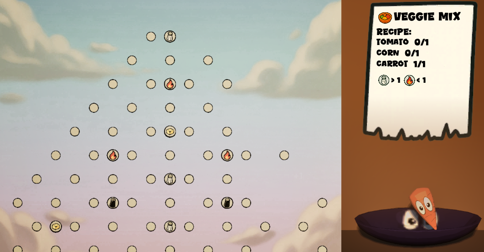
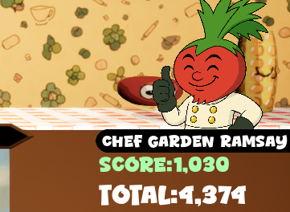
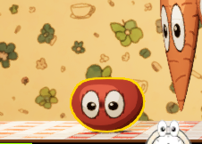
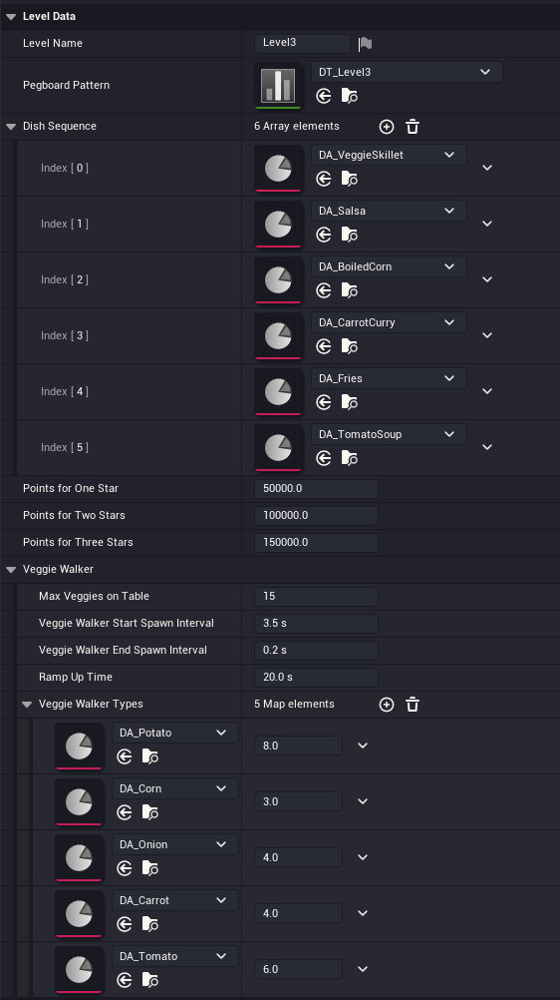
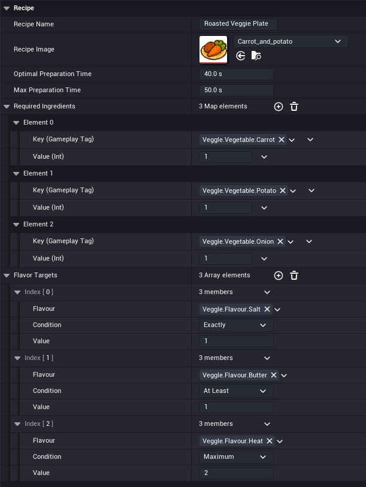
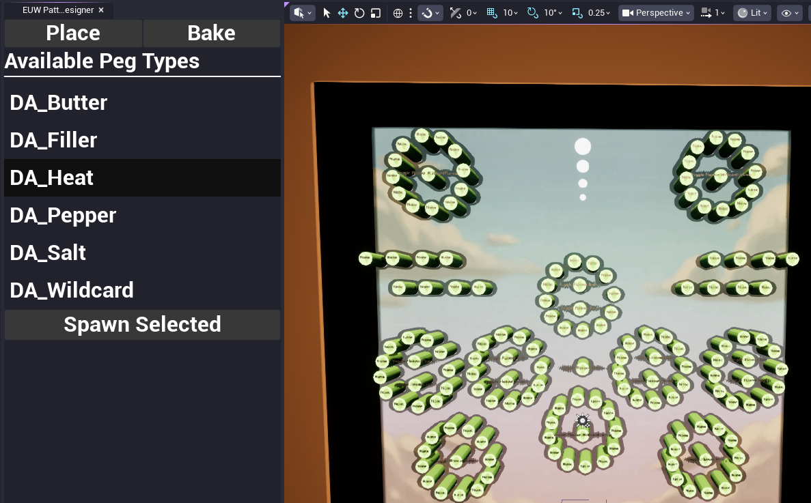
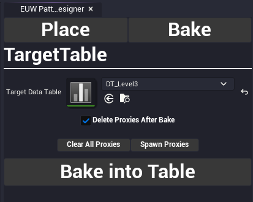

# Veggle – Peggle-inspired Cooking Game (UE5, C++ + GAS)

[Play Veggle on itch.io](https://v4lk.itch.io/veggle)

Veggle is a Peggle-style physics game where you cook dishes by shooting veggie balls into a pegboard. It was created in one week for the Ryan Laley Games Jam 2025, with the full commit history preserved in version control (though not hosted on GitHub). It was also used as a playground to practice clean, scalable Unreal Engine architecture under time pressure.

---

## Overview

  

  
  

- **Engine:** Unreal Engine 5 (C++ + Blueprints)
- **Core ideas:**
  - Peggle-style pegboard with cooking-themed scoring
  - Gameplay Ability System (GAS) used for points, multipliers, and flavor stats
  - Data assets for levels, dishes, veggies, commentary, and walking veggies
  - Event-driven UI and commentator system
  - Dual local-player setup to drive two interactive camera views (orthographic + perspective)

---

## Gameplay

Before each shot, veggies are hopping around on the table. You first **pick a veggie** you want to use, which turns it into a **veggie ball** you can then launch from the bowl into the pegboard.

- Select a veggie from the table at the top of the screen.
- Aim with the cursor and launch the veggie ball into the pegboard.
- Hit different peg types to build up score and **flavor multipliers** (butter, salt, pepper, heat, wildcard).
- Clear special pegs and the board to complete dishes and earn better ratings.
- A commentator ("Garden Ramsey") reacts contextually with VO and UI reactions.

---

## Architecture highlights

The project uses a fairly standard Unreal game architecture with an emphasis on separating data, flow, and execution.

### Core game flow (`Source/Veggle/Core/`)

- `AVeggleGameMode`
  - Controls the overall match flow (pregame, gameplay, postgame) using Unreal's match state callbacks.
  - Spawns and tracks the current dish actor (`AVeggleDish`) based on `UVeggleLevelData`.
- `AVeggleGameState`
  - Holds the current dish state and score/progression information.
- `UVeggleGameInstance`
  - Stores the selected level data (`UVeggleLevelData`) and basic configuration such as the save-game slot.

Level configuration (`UVeggleLevelData`) and other data assets are kept separate from the runtime logic so that new content can be added without changing code.

### Pegboard & launcher (`Source/Veggle/Pegboard/`)

- `AVeggleLauncherPawn`
  - Handles aiming and shooting of veggie balls.
  - Uses an in-world `UWidgetComponent` as an aiming aid.
  - Allows configuration such as `bAllowAimAbove`, `MinAimDistance`, and the ball class.
- `AVegglePegboard`, `AVeggleBall`, `AVeggleBallCollector`
  - The pegboard owns peg layout and data.
  - Uses instanced static meshes for pegs, with per-instance gameplay tags and effects so each peg can have its own behavior and scoring logic.
  - Balls handle physics, collisions, and notify when their run ends.
  - The collector detects finished balls and signals that a shot can be resolved.

Ball types and peg behavior are configured via data assets (`UVeggleBallData`, peg data) instead of hard-coded values.

### Gameplay Ability System (GAS) for scoring & flavors (`Source/Veggle/AbilitySystem/`)

- `UVeggleVeggieAttributeSet`
  - Tracks per-shot statistics such as:
    - `HitCount`
    - `SpecialMultiplier`, `FillerMultiplier`, `BoardClearedBonusMultiplier`
    - Flavor attributes: `Butter`, `Salt`, `Pepper`, `Heat`, `WildcardFlavour`
  - Uses `PostAttributeChange` and an `OnAttributeChanged` delegate to notify UI and other systems of changes.
- `UVeggleDishAttributeSet`
  - Handles dish-level attributes (overall dish score, completion thresholds, etc.).
- Execution calculation (`VeggleAccumulateVeggieData`)
  - A custom execution calculation that reads the current veggie and dish attributes, applies the active gameplay effects and multipliers, and produces the final dish result in a single, consistent place.
  - This keeps the scoring and evaluation logic centralized and makes it easy to extend with additional effects or rules if the design grows.
- `UVeggleGameplayEffectContext` & `UVeggleAbilitySystemGlobals`
  - Extend GAS with custom context data and global behavior.

GAS is used as a flexible stat and effect system for Veggle's scoring and flavor logic, providing a clear upgrade path if the game ever needed more complex or layered rules.

### Data-driven content

Common gameplay concepts are modeled as data assets, for example:

- `UVeggleLevelData` – level selection, which dishes appear, difficulty tuning.
- `UVeggleRecipeData` – requirements and thresholds for individual dishes.
- `UVeggleWalkingVeggieData` – ambient walkers' behavior and types.
- `UVeggleCommentData` – commentator lines, triggers, and moods.

Most of the moment-to-moment tuning (difficulty, thresholds, which pegs appear) can be changed from the editor without touching the C++ code.

### Event & commentator system (`Source/Veggle/Events/`, `Source/Veggle/Commentator/`)

- `UVeggleEventSubsystem` and `FVeggleEventPayloads`
  - Provide a central event layer for high-level game events (e.g., dish completed, big combo, risky shot, near miss).
- `UGardenRamseyWidget` and `UVeggleCommentData`
  - Subscribe to events and display context-sensitive reactions (UI and VO).

This keeps gameplay logic and presentation loosely coupled; new reactions or listeners can be added without modifying the core pegboard or scoring code.

### Dual local-player / camera setup

To get two different interactive camera setups at the same time (one orthographic, one perspective, both cursor-interactive), the project uses **two local players**, each with its own camera.

- Using local players allows both views to participate in input handling and hit testing.
- A more "correct" solution for a full-scale project would likely use a custom camera manager or scene capture setup, but for a small jam game this approach keeps the interaction model straightforward.

---

## Tools & editor workflow

Designer- and workflow-focused tooling is an important part of this project.

  
  

- **Custom pegboard editor plugin**
  - An in-editor window/button that lets the designer:
    - Configure pegboard layouts directly in the editor.
    - Save layouts to a data table.
    - Load layouts from data tables so multiple levels can share a single map.
- **Gameplay tags & logging**
  - `VeggleGameplayTags` – central location for gameplay tags used across GAS, events, and UI.
  - `VeggleLogChannels` – custom log categories for filtering Veggle-specific logs.
- **Misc editor helpers**
  - `VeggleEditorUtils` – small editor-only helpers to speed up content iteration.

---

## Credits

- **Programming & systems:** Nicolas Martin
- **Design (gameplay, levels, stats):** Vladimír Eck
- **3D models & textures (vegetables and related assets):** Elise Moll
- **Voice of "Garden Ramsey":** Nicklas Eliasson

For a deeper look at the implementation, start with `Source/Veggle/` and the modules under `Core`, `Pegboard`, `AbilitySystem`, `Commentator`, and `Events`.
